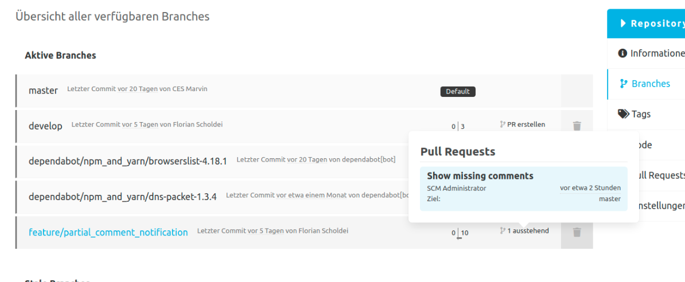

## Pull Requests für Branches

Auf der Branch Übersicht werden pro Branch die dazugehörigen Pull Requests angezeigt. 
Sollte es noch keinen Pull Request für einen Branch geben, kann über den Link ein neuer Pull Request erstellt werden.
Für den Pull Request werden neben dem Titel auch der Autor, das Erstellungsdatum und der Ziel-Branch angezeigt.

