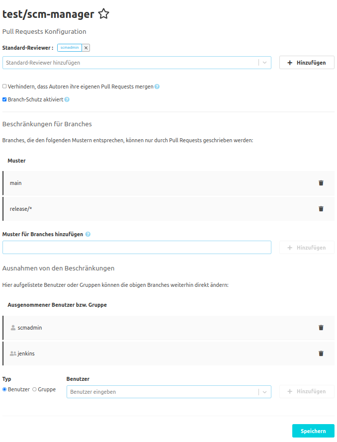

## Konfiguration

Für Pull Requests können ein paar Einstellungen vorgenommen werden.
Diese Konfiguration kann entweder global oder Repository-spezifisch geschehen. Die globale Konfiguration
findet sich unter "Administration" - "Einstellungen" - "Pull Requests". Ähnlicherweise findet sich die
Repository-spezifische Konfiguration in der Repository-Navigation unter "Einstellungen" - "Pull Requests".
Wenn Repository-spezifische Einstellungen vorhanden sind, überschreiben diese die globalen Einstellungen.

Um das Überschreiben der Einstellungen in Repositories zu verhindern kann in den globalen Einstellungen der
Punkt "Pull Request Konfiguration nicht für einzelne Repositories erlauben" aktiviert werden.

Die anderen Einstellungen sind für die globale und Repository-spezifische Konfiguration identisch.
Alle Änderungen müssen mit "Speichern" aktiviert werden.

## Beschränkungen für Branches

Es können Branches spezifiziert werden, die nicht direkt, sondern nur durch Pull Requests verändert werden können.
Hierfür muss "Branch-Schutz aktiviert" gewählt werden. Wenn dieses der Fall ist, werden zwei weitere Tabellen
angezeigt, in denen geschützte Branches und Ausnahmen für bestimmte Benutzer und Gruppen spezifiziert werden.

Die erste Tabelle enthält Muster für Branchnamen, die geschützt werden. Hier können Branches entweder fest
angegeben werden (wie `main`), oder als Muster (wie `releases/*`).

Wenn es spezielle Benutzer gibt, die trotz dieser Beschränkungen weiterhin Branches direkt verändern können sollen
(wie z. B. für Build Automatisierung), können diese Benutzer oder Gruppen in der zweiten Tabelle angegeben werden.
Um Benutzer oder Gurppen hinzuzufügen, muss zunächst gewählt werden, ob es sich um einen Benutzer oder eine Gruppe
handelt. Danach kann der konkrete Name eingegeben oder gesucht werden. Anschließend kann der Eintrag zu der Tabelle
hinzugefügt werden.

## Mergen von Pull Requests

In den meisten Fällen werden Pull Requests nicht von denjenigen gemerged, die sie erstellt haben. Dieses kann
daher auch konkret verhindert werden. Hierzu dient die Option "Verhindern, dass Autoren ihre eigenen Pull
Requests mergen".
