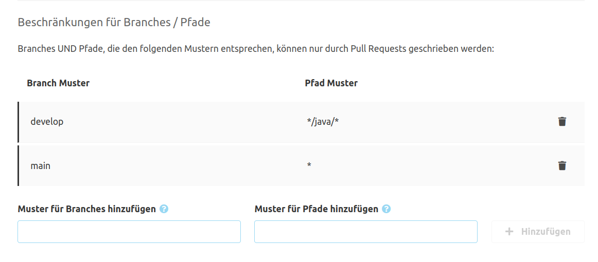

Für Pull Requests können ein paar Einstellungen vorgenommen werden.
Diese Konfiguration kann entweder global oder Repository-spezifisch geschehen. Die globale Konfiguration
findet sich unter "Administration" - "Einstellungen" - "Pull Requests". Ähnlicherweise findet sich die
Repository-spezifische Konfiguration in der Repository-Navigation unter "Einstellungen" - "Pull Requests".
Wenn Repository-spezifische Einstellungen vorhanden sind, überschreiben diese die globalen Einstellungen.

Um das Überschreiben der Einstellungen in Repositories zu verhindern kann in den globalen Einstellungen der
Punkt "Pull Request Konfiguration nicht für einzelne Repositories erlauben" aktiviert werden.

Die anderen Einstellungen sind für die globale und Repository-spezifische Konfiguration identisch.
Alle Änderungen müssen mit "Speichern" aktiviert werden.


## Merge Dialog

Hier können die Standardwerte für Merges eingestellt werden. Diese sind:

  - Die **Standard-Merge-Strategie** stellt ein, welche Merge Strategie per Default im Merge Dialog ausgewählt ist.
  - Wenn die Option **Source Branch beim Merge löschen** aktiviert ist, wird im Merge Dialog per Default die Option
    zum Löschen des Source Branch aktiviert.
  - Mit der Option **Default Commit-Nachricht überschreiben** kann eine eigene Commit-Nachricht definiert werden, die
    als Vorschlag im Merge Dialog gesetzt wird. Diese ersetzt somit die Standardnachrichten des SCM-Managers.
    
    In dieser Nachricht können Template-Mechanismen genutzt werden, indem in doppelten geschweiften Klammern gesetzte
    Variablen (`{{variable}}`) angesprochen werden. Variablen mit Listen an Daten können mit `{{#variable}}` und
    `{{/variable}}` iteriert werden. Bei booleschen Werten können mit dieser Syntax Blócke markiert werden, die nur
    dann dargestellt werden, wenn dieser Wert 'wahr' ist.
    
    Die folgenden Variablen stehen zur Verfügung:
    - `namespace` Der Namespace des Repositories
    - `repositoryName` Der Name des Repositories
    - `pullRequest.id` Die ID des Pull Requests
    - `pullRequest.title` Der Titel des Pull Requests
    - `pullRequest.description` Die Beschreibung des Pull Requests
    - `pullRequest.source` Der Quellbranch
    - `pullRequest.target` Der Zielbranch
    - `author.displayName` Der Name des Autoren
    - `author.mail` Die E-Mail des Autoren
    - `currentUser.displayName` Der Name des angemeldeten Users
    - `currentUser.mail` Der E-Mail des angemeldeten Users
    - `date` Das aktuelle Datum mit der aktuellen Uhrzeit (UTC)
    - `localDate` Das aktuelle Datum mit der aktuellen Uhrzeit (Zeitzone des Servers)
    - `changesets` Die Commits, die über diesen Pull Request gemerged werden. Die Attribute in den einzelnen Commits sind:
      - `author.name` Autor des Commits
      - `author.mail` E-Mail des Autoren
      - `description` Die Nachricht
      - `id` Die Revision
    - `contributors` Mitwirkende an diesem Pull Request mit den folgenden Attributen:
      - `type` Art der Mitwirkung
      - `person.name` Name
      - `person.mail` E-Mail-Adresse
    
    Die genaue Anleitung zu der Syntax von Mustache finden sich auf der [Mustache Hilfeseite](https://mustache.github.io/).
    
    In dem folgenden Beispiel werden neben einigen Metadaten des Pull Requests die einzelnen Nachrichten der Commits und
    die Mitwirkenden aufgelistet:
    
```
Pull Request #{{pullRequest.id}} by {{author.displayName}}

Merged by {{currentUser.displayName}}

Merges the following commits:
{{#changesets}}
  - {{description}}
{{/changesets}}

Contributors:
{{#contributors}}
  {{type}}: {{person.name}} ({{person.mail}})
{{/contributors}}
```

## Erstellung

Für die Erstellung von Pull Requests gibt es gibt es verschiedene Einstellungen, die im Folgenden beschrieben werden.

### Verfügbare Labels

Pull Requests können Labels haben. Diese können zur weiteren Klassifikation von Pull Requests genutzt werden,
wie z. B. `feature`, `bug`  oder `library`.

### Standard Aufgaben

Wenn es Aufgaben gibt die für die Mehrzahl an Pull Requests zu beachten sind, können diese
hier als Standard Aufgaben definiert werden. Während der Erstellung von Pull Requests können
diese dann entfernt werden, wenn sie für den aktuellen Pull Request nicht passend sind.
Standard Aufgaben können z. B. "Übersetzung gepflegt" oder "Eintrag für Changelog angelegt" sein.

Diese Aufgaben können (wie bei der Erstellung als Reviewer im Pull Request) mit Markdown formatiert werden.

### Standard-Reviewer

Falls Reviews für Pull Requests immer von gleichen "Peers" durchgeführt werden soll, können diese
als Standard-Reviewer angelegt werden. Während der Erstellung von Pull Requests kann diese Liste dann
durch Hinzufügen oder Entfernen von Einträgen angepasst werden.

## Beschränkungen für Branches

Es können Branches spezifiziert werden, die nicht direkt, sondern nur durch Pull Requests verändert werden können.
Hierfür muss "Branch-Schutz aktiviert" gewählt werden. Wenn dieses der Fall ist, werden zwei weitere Tabellen
angezeigt, in denen geschützte Branches und Ausnahmen für bestimmte Benutzer und Gruppen spezifiziert werden.

Die erste Tabelle enthält Muster für Branchnamen und Pfade, die geschützt werden. Hier können Branches entweder fest
angegeben werden wie `main` oder als Muster wie `releases/*`. 
Für Pfade können Sie auch einfache Pfade wie `src/main/java` (ohne führenden Slash) oder Muster mit Wildcards `*/java/*` verwenden.
Beide Werte werden durch `UND` kombiniert, um also einen ganzen Branch zu schützen, sollte der Pfad `*` sein.



Wenn es spezielle Benutzer gibt, die trotz dieser Beschränkungen weiterhin Branches direkt verändern können sollen
(wie z. B. für Build Automatisierung), können diese Benutzer oder Gruppen in der zweiten Tabelle angegeben werden.
Um Benutzer oder Gruppen hinzuzufügen, muss zunächst gewählt werden, ob es sich um einen Benutzer oder eine Gruppe
handelt. Danach kann der konkrete Name eingegeben oder gesucht werden. Anschließend kann der Eintrag zu der Tabelle
hinzugefügt werden.

## Mergen von Pull Requests

In den meisten Fällen werden Pull Requests nicht von denjenigen gemerged, die sie erstellt haben. Dieses kann
daher auch konkret verhindert werden. Hierzu dient die Option "Verhindern, dass Autoren ihre eigenen Pull
Requests mergen".

## Standard-Reviewer

Für jedes Repository kann eine Auswahl an Standard-Reviewern konfiguriert werden.
Das Reviewer-Feld im Pull Request-Erstellungsformular wird dadurch automatisch vorausgefüllt.
