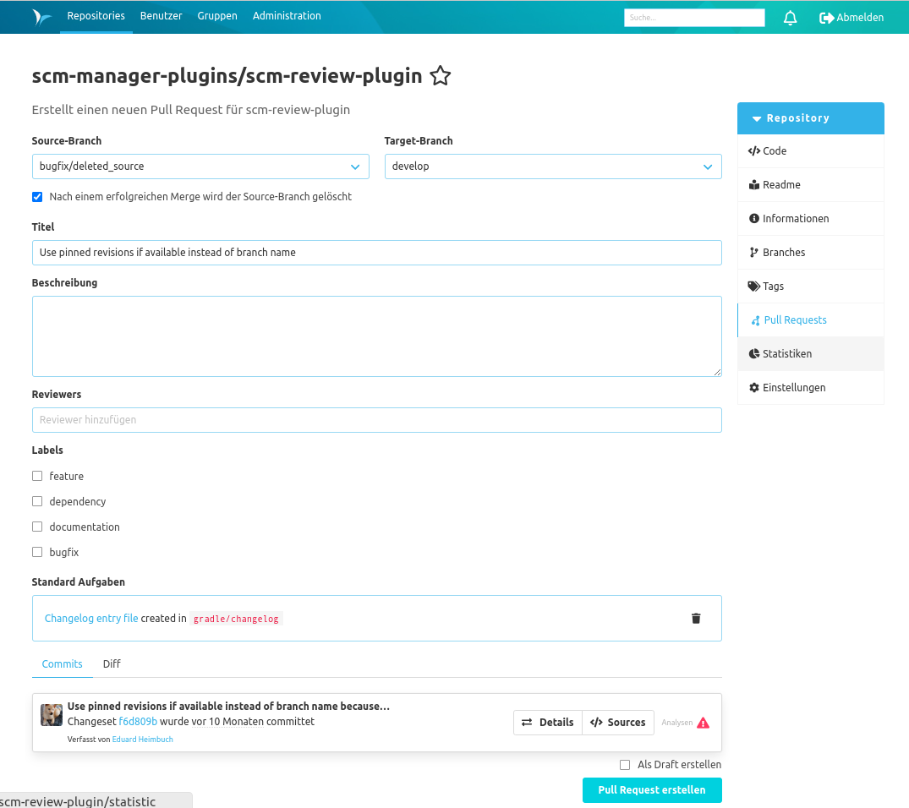

Unterhalb der Tabelle kann mit Klick auf die Schaltfläche ein neuer Pull Requests für das aktuelle Repository erstellt werden.
Nach Auswahl des Source und Target Branchs muss ein Titel festgelegt werden. Zudem können eine Beschreibung (Markdown wird unterstützt) und Reviewer zugeordnet werden. Wurden Reviewer eingetragen, erhalten diese bei der Erstellung des Pull Requests eine E-Mail. 

Im unteren Bereich können die Änderungen zwischen den gewählten Branches in Form von Commits und als Unterschiede auf Dateiebene (in Diff-Ansichten) geprüft werden. Jedem Pull Request wird eine einmalige, fortlaufende Nummer zugeordnet, über die er eindeutig im Kontext identifiziert werden kann.

