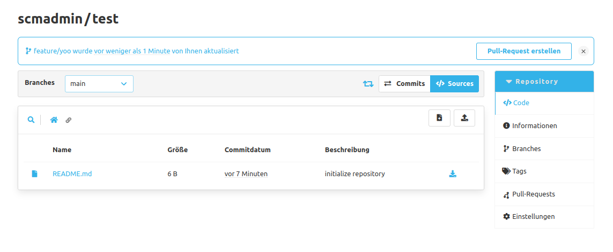

Oberhalb der Pull Request Übersicht kann mit Klick auf die Schaltfläche ein neuer Pull Requests für das aktuelle Repository erstellt werden.
Nach Auswahl des Source und Target Branches muss ein Titel festgelegt werden.
Außerdem kann hier bereits über die Checkbox vorausgewählt werden, ob der Source Branch bei einem erfolgreichen Merge gelöscht werden soll. 
Diese Vorauswahl lässt sich im Merge Dialog ändern. 
Zudem können eine Beschreibung (Markdown wird unterstützt) und Reviewer zugeordnet werden.
Wurden Reviewer eingetragen, erhalten diese bei der Erstellung des Pull Requests eine E-Mail.
Unterhalb der Reviewer befindet sich eine Liste mit Standard Aufgaben, sofern diese in den Einstellungen angelegt wurden. 
Die Standard Aufgaben können für den Pull Request entfernt werden, wenn sie nicht benötigt werden.

Im unteren Bereich können die Änderungen zwischen den gewählten Branches in  Form von Commits und als Unterschiede auf Dateiebene (in Diff-Ansichten) geprüft werden.
Jedem Pull Request wird eine einmalige, fortlaufende Nummer zugeordnet, über die er eindeutig im Kontext identifiziert werden kann.

Zudem besteht mittels Checkbox die Option den Pull Request mit dem Status "Draft" anzulegen. 
Ein Draft Pull Request ist ein vollwertiger Pull Request, jedoch weist der Status "Draft" darauf hin, dass dieser Pull Request noch nicht bereit für ein Review ist bzw. der Autor diesen noch weiter bearbeiten möchte.

Zusätzlich zeigt das Review-Plugin Vorschläge an, ob man für einen aktualisierten Branch ein Pull Request erstellen möchte.
Diese Vorschläge werden in Bannern unterhalb des Namespaces und dem Namen eines Repositories dargestellt.
Jeder Vorschlag enthält die Information welcher Branch aktualisiert wurde und wann das geschehen ist.
Zusätzlich beinhalten die Vorschläge zwei Buttons.
Mit dem ersten kann sich der Benutzer direkt zur Ansicht für das Erstellen eines Pull Requests navigieren lassen.
Dabei wird der jeweilige Branch auch als Source Branch vorausgewählt.
Mit dem zweiten kann der Benutzer diesen Vorschlag direkt löschen.

Einem Benutzer werden nur Vorschläge zu Branches gezeigt, welche vom Benutzer selbst aktualisiert wurden und zu denen noch kein Pull Request besteht.
Ein Vorschlag bleibt zwei Stunden bestehen, insofern er nicht vorher vom Benutzer gelöscht oder ein Pull Request mit dem jeweiligen Branch erstellt wurde.

