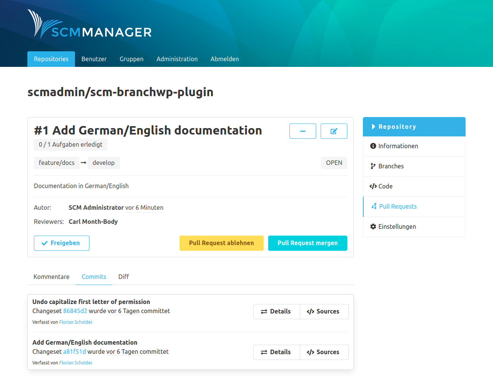
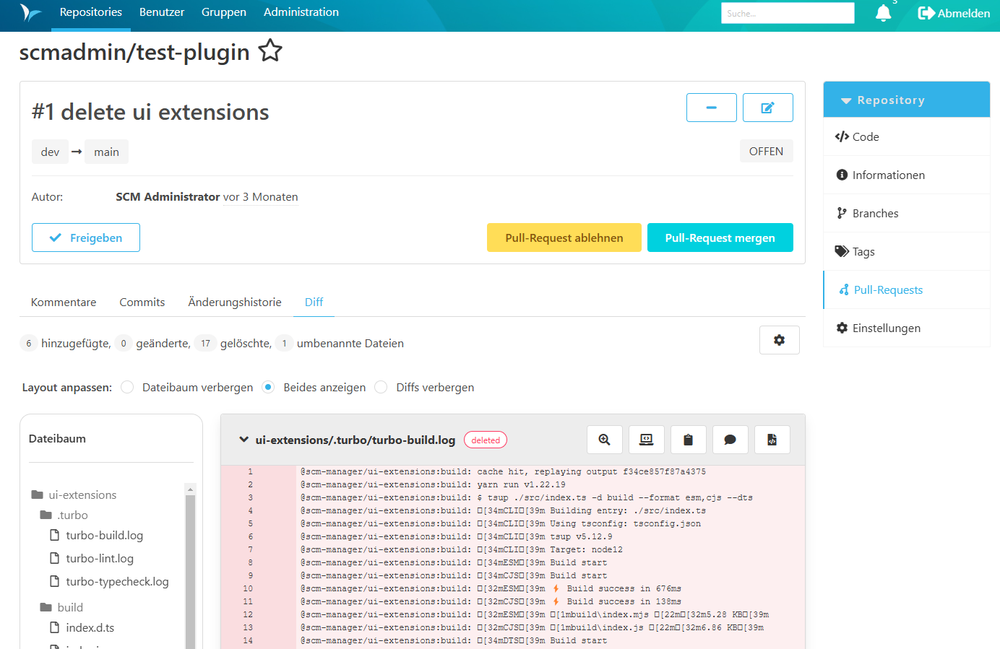

Die Detailseite unterteilt sich in zwei Bereiche. Im oberen umrahmten Teil wird der generelle Pull Request mitsamt möglichen Interaktionen dargestellt. Darunter lassen sich die eigentlichen Änderungen des Pull Requests in unterschiedlichen Tabs anzeigen und kommentieren.

### Kommentare
In dem Tab "Kommentare" findet man alle Kommentare und Aufgaben, die zu diesem Pull Request erstellt wurden.

### Commits
Der "Commits"-Tab zeigt alle Commits des Source Branches an, ab dem Commit wo die Branches sich unterscheiden.

### Diff
Unter "Diff" findet man die Änderungen der Dateien zwischen dem Source Branch und dem Ursprung von Target und Source Branch.
Auf der linken Seite gibt es einen Dateien-Baum der jede Datei anzeigt die geändert wurde.
Um zu einer bestimmten Datei zu springen ist ist es möglich im Baum diese Datei auszuwählen.

Für jede Datei gibt es mehrere Schaltflächen für verschiedene Optionen, wie

- den Diff vergrößern
- Leerzeichen-Zeichen anzeigen oder ausblenden
- die Datei als "gerevied" markieren (dies ist nur für Ihren persönlichen Workflow und hat keine weiteren Auswirkungen;
  wenn eine entsprechend markierte Datei geändert wird, wird die Markierung entfernt)
- einen Kommentar auf Dateiebene erstellen
- zur Source- oder Target-Datei springen
- eine Schaltfläche, die einen Merge-Konflikt für diese Datei anzeigt, falls vorhanden

Auf der linken Seite, direkt über der Diff-Ansicht, kann man eine Zusammenfassung der neuen, geänderten, gelöschten, umbenannten und kopierten Dateien sehen.

Auf der rechten Seite, direkt gegenüber der Zusammenfassung der Dateien, befindet sich ein Zahnrad-Menü mit den folgenden Optionen:
- Mit der ersten Checkbox können die Whitespaces-Änderungen ein- und ausgeblendet werden.
- Die zweite ermöglicht das Ein- und Ausblenden aller Changesets.

Für die Diffs gibt es drei Radio-Buttons um das Layout zu ändern:
- Mit dem ersten Button werden nur die Diffs angezeigt.
- Mit dem zweiten Button werden die Diffs und der Dateibaum angezeigt.
- Mit dem letzten Button wird nur der Dateibaum angezeigt.

Die Änderungen sind nach dem bekannten Format für Diffs farblich gekennzeichnet:

- **Weiß:** Keine Änderungen
- **Grün:** Zeile hinzugefügt
- **Rot:** Zeile entfernt
- **Rot + Grün:** Zeile geändert

### Konflikte
Sollten Merge-Konflikte in einem Pull Request existieren, gibt es zusätzlich den Tab "Konflikte". Dort zeigt der SCM-Manager die Merge-Konflikte zwischen dem Source Branch und dem Target Branch an. 

Über dem eigentlichen Konflikt bekommt man eine Anleitung angeboten, wie dieser Merge-Konflikt behoben werden kann.

Der Konflikt wird im Git-Konflikte-Format innerhalb eines Diffs in Gelb angezeigt. In der Kopfzeile des Diffs wird über einen "Tag" hervorgehoben, wie dieser Konflikt entstanden ist.

Folgende Tags sind möglich:

- **Konflikt**: Datei wurde auf beiden Branches in denselben Zeilen geändert
- **im Target gelöscht:** Datei wurde im Source Branch geändert und auf dem Target Branch gelöscht
- **im Source gelöscht:** Datei wurde im Source Branch gelöscht und auf dem Target Branch verändert
- **in Source und Target hinzugefügt:** In beiden Branches wurde eine neue Datei mit selbem Dateinamen und -pfad aber unterschiedlichem Inhalt hinzugefügt

