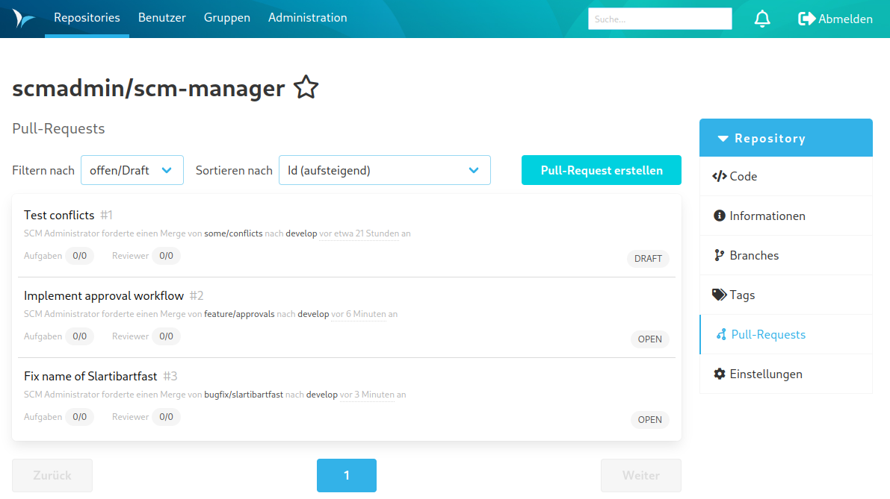

Der Großteil aller vom Review-Plugin mitgelieferten Funktionalität sind innerhalb eines Git Repositories unter dem Tab 
"Pull Requests" zu finden. Beim Aufruf des Bereichs erscheint eine Übersicht aller derzeit offenen Pull Requests. 

Diese Übersicht lässt sich nach den folgenden Kategorien filtern:

- offen/Draft (Standard): Alle offenen Pull Requests
- meine: Pull Requests des eingeloggten Nutzers
- zu reviewen: Pull Requests, die der eingeloggte Nutzer kontrollieren soll
- alle: Alle Pull Requests
- abgelehnt: Abgelehnte Pull Requests
- gemerged: Akzeptierte Pull Requests

Die Sortierung lässt sich durch ein weiteres Auswahlelement einstellen.
Die Übersichts-Liste zeigt pro Repository die folgenden Informationen an:

- Titel (vom Autor festgelegter Name des Pull Requests)
- Autor bzw. Ersteller des Pull Requests
- Source Branch (Branch, der die Änderungen enthält / Quelle)
- Target Branch (Branch, auf welchen die Änderungen angewendet werden sollen / Ziel)
- Erstellungsdatum bzw. Alter des Pull Requests
- Anzahl der offenen und insgesamt vorhandenen Aufgaben zum Pull Request
- Anzahl der Reviewer und Zahl der Freigaben
- Status des Pull Requests (Offen, Draft, Gemerged oder Abgelehnt)
- Status der Workflows, die für das Repository festgelegt wurden

Zudem können durch andere Plugins weitere Daten hinzugefügt werden, wie z. B. CI-Analysen.

