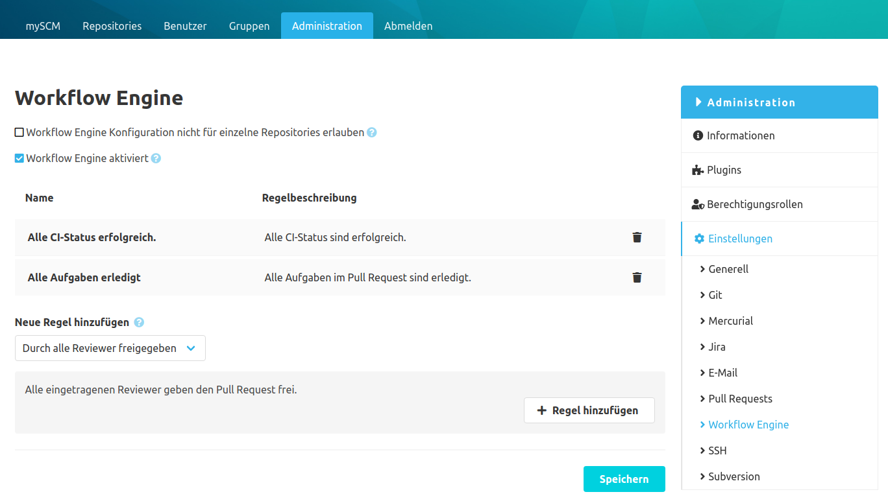
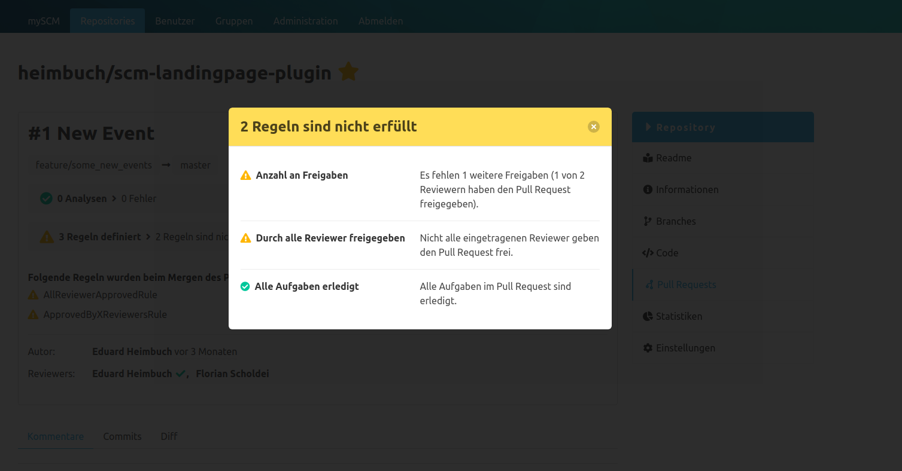
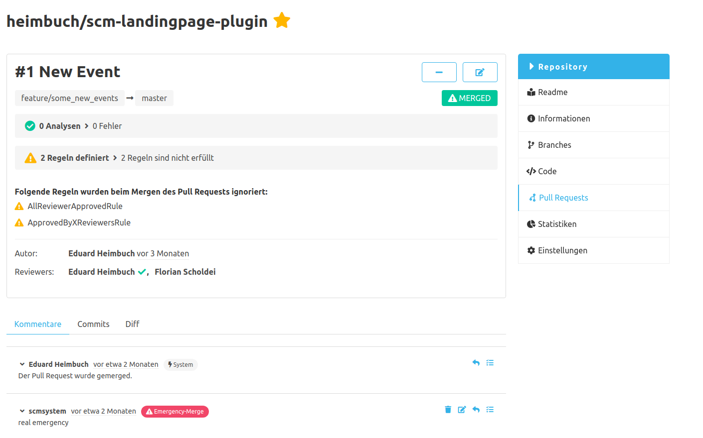

## Konfiguration
Hinter dem Begriff "Workflow Engine" befindet sich eine Auswahl von Regeln, mit denen Pull Requests validiert werden können. 
Durch das Setzen der Regeln kann ein Review-Prozess bei den Pull Requests erzwungen werden. 
Wurde die Workflow Engine global oder im Repository aktiviert, müssen alle Pull Requests sämtliche definierte Regeln erfüllen, bevor ein Merge durchgeführt werden kann. 
Sind beide Workflow Engine Konfigurationen aktiv, gilt die spezifischere Konfiguration aus dem Repository und keine additive Kombination aus beiden.
Über die globale Konfiguration kann die Repository Konfiguration deaktiviert werden.

### Regeln
Die Workflow Engine unterstützt derzeit folgende Regeln, die teilweise auch nur in Kombination mit anderen Plugins verfügbar sind:

#### Allgemein
- `Anzahl an Freigaben`: Es müssen mindestens X Freigaben von Reviewern erfolgt sein
- `Durch alle Reviewer freigegeben`: Alle eingetragenen Reviewer müssen den Pull Request freigegeben haben
- `Alle Aufgaben erledigt`: Es gibt keine offenen Aufgaben an diesem Pull Request

### Mit dem CI-Plugin
- `Alle CI-Status erfolgreich`: Alle gemeldeten CI-Status an dem Pull Request sind erfolgreich (grün)
- `Ein benannter CI-Status erfolgreich`: Es muss ein bestimmter CI-Status erfolgreich sein
- `Alle CI-Status eines Typs erfolgreich`: Es müssen alle CI-Status eines definierten Typs erfolgreich sein, z. B. alle Jenkins Builds sind grün
- `Anzahl erfolgreicher CI-Status`: Es müssen mindestens X CI-Status erfolgreich sein

## Regeln am Pull Request
Der Status der Regeln am Pull Request wird über eine Statusbar abgebildet. 
Mit einem Klick auf diese Bar öffnet sich ein Dialog mit einer Übersicht über genauen Status jeder Regel.

## Emergency Merge
Die Workflow Engine erzwingt Prozessabläufe, kann damit aber auch einen kritischen Pull Request blockieren. 
Damit wichtige Änderungen sehr kurzfristig gemerged werden können, obwohl die Regeln nicht erfüllt sind, gibt es einen "Emergency Merge". 
Der Emergency Merge kann nur von Benutzern mit einer speziellen Berechtigung ausgeführt werden.
Es handelt sich dabei um einen "normalen" Merge mit dem Unterschied, dass der Regelverstoß am Pull Request dokumentiert wird.

Wurde die Workflow Engine in einem Pull Request übergangen:
- erhält das Merge-Label ein Ausrufezeichen
- werden die gebrochenen Regeln unterhalb der Pull Request Beschreibung aufgeführt
- wird ein System-Kommentar mit dem Label "Emergency-Merge" am Pull Request erzeugt
 

