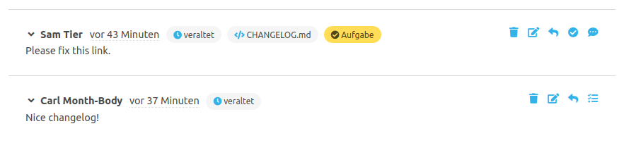
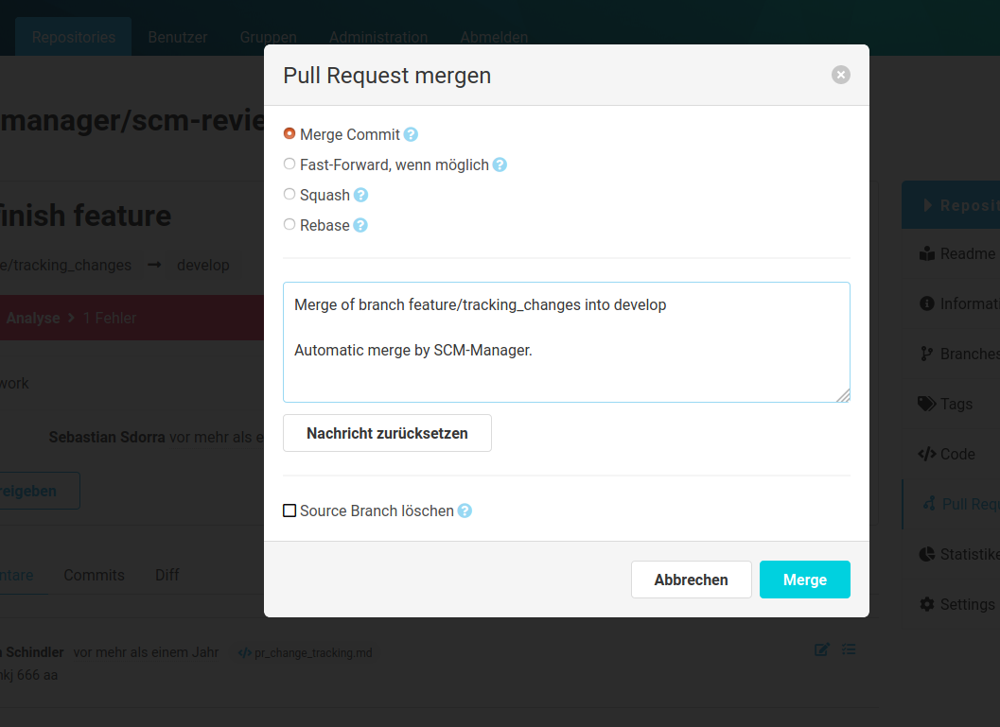

Für ein effizientes Arbeiten mit Pull Requests gibt es unterschiedliche Möglichkeiten Informationen zwischen dem Autor und dessen Reviewern auszutauschen.

### Reviewer hinzufügen
Der Autor kann beim Erstellen bzw. Editieren seines Pull Requests Wunsch-Reviewer eintragen. Diese Reviewer werden per E-Mail über das anstehende Review informiert und sind in den Pull Request Details aufgelistet. 

### Pull Request abonnieren
Oben rechts auf der Pull Request Detailseite kann ein Reviewer mit einem Klick auf den "+" (Plus) bzw. "-" (Minus) Button diesen Pull Request abonnieren / deabonnieren.  Der Abonnent wird über Änderungen an diesem Pull Request und neue Kommentare per E-Mail benachrichtigt.

### Pull Request freigeben
Nach einem Review kann der Reviewer den Pull Request für den Merge freigeben. Die Freigabe gilt vorerst nur als Informationen für den Autor über das durchgeführte Review. Sobald ein Reviewer auf "Freigeben" klickt, wird hinter seinem Namen in der Reviewer-Liste ein grüner Haken angezeigt.
Wenn später Änderungen am Code vorgenommen werden, wird der Reviewstatus zurückgesetzt.

Mit Hilfe der [Workflow Engine](../workflow_engine/) können Regeln definiert werden, die im Rahmen des Review-Prozesses Freigaben von Reviewern erfordern.

### Diff erweitern
Innerhalb des Pull Request werden die Änderungen in verkürzten Diffs pro Datei angezeigt. 
Diese Diffs können auch schrittweise oder komplett nachgeladen werden, um den gesamten Inhalt der Datei zu sehen.

### Kommentare erstellen
Für einen Pull Request können drei Arten von Kommentaren erstellt werden. 

- **Allgemeiner Kommentar:** Bezieht sich auf den Pull Request als Ganzes. Kann im Kommentar-Tab über den Kommentar-Editor erstellt werden.
- **Datei-Kommentar:** Kann im Diff-Tab in der Kopfzeile einer Datei über "Kommentar hinzufügen" erstellt werden.
- **Zeilen-Kommentar:** Kann über einen Klick auf eine Zeile im Diff erstellt werden.

Alle Kommentare findet man in dem Kommentar-Tab. Die Datei- und Zeilen-Kommentare findet man auch direkt an der Datei in dem Diff-Tab. 
Es ist möglich innerhalb von Kommentaren andere Benutzer des SCM-Managers zu erwähnen. Dafür beginnt man mit einem "@"-Zeichen und tippt danach den Namen, Benutzername oder die E-Mail-Adresse des Benutzers. 
Ab dem dritten Zeichen werden über eine Autovervollständigung passende Benutzer vorgeschlagen. Erwähnte Benutzer werden per E-Mail benachrichtigt, dass sie in dem Kommentar erwähnt wurden.

Zudem ist es möglich, Bilder in Kommentaren zu nutzen. Dafür kann ein Bild per Copy & Paste in den Kommentar-Editor eingefügt werden.
Dieses Bild wird dann als Markdown-Bild in den Kommentar eingefügt und beim Speichern des Kommentars separat im
SCM-Manager gespeichert. Bilder können entweder direkt über die Zwischenablage (z. B. bei Nutzung eines Screenshot-Tools)
oder durch Kopieren einer Bilddatei in den Editor eingefügt werden. Erlaubt sind dabei die Bildformate PNG, JPEG und GIF.

Erstellte Kommentare bieten folgende Interaktions-Möglichkeiten:

|Icon|Bedeutung|
|---|--------------------------------------------|
||Kommentar löschen|
||Kommentar bearbeiten|
||Kommentar in Aufgabe umwandeln|
||Aufgabe in Kommentar umwandeln|
||Auf Kommentar bzw. Aufgabe antworten|
||Aufgabe als erledigt markieren|
||Aufgabe als _nicht_ erledigt markieren|

### Veraltete Kommentare
Sobald ein Pull Request neue Commits erhält, werden die Kommentare teilweise als veraltet markiert. Allgemeine Kommentare gelten nach jedem neuen Commit als veraltet und Datei- bzw. Zeilen-Kommentare nach einem Commit, der die entsprechende Datei ändert.

Diese Kommentare werden mit einem "Veraltet"-Tag markiert. Mit einem Klick auf einen blauen Veraltet-Tag bzw. einen blauen Dateinamen-Tag, öffnet sich der ursprüngliche Kontext, zu dem dieser Kommentar erstellt wurde. Damit lässt sich auch nach neuen Änderungen nachvollziehen, warum dieser Kommentar erstellt worden war.

### Gleichzeitige Bearbeitung
Da mehrere Benutzer zeitgleich einen Pull Request reviewen oder bearbeiten können, ist es möglich neue Änderungen nicht mitzubekommen. 
Daher werden alle Bearbeiter, die einen Pull Request geöffnet haben, über Änderungen an diesem Pull Request mit einer Meldung informiert.

### Aufgaben erstellen
Sollte ein Reviewer Fehler finden oder Änderungen am Pull Request vorschlagen wollen, kann er dies über Aufgaben realisieren. Der Kommentar-Editor kann über einen Radio-Button zu einem Aufgaben-Editor umgeschaltet werden. Aufgaben werden in den Pull Request Details und in der Übersichtstabelle über einen Tag angezeigt, beispielsweise "2 / 5 Aufgaben erledigt". 

Offene Aufgaben können über ein Icon auf "abgeschlossen" gesetzt werden. Aufgaben sind derzeit noch informativ und keine zwingende Voraussetzung zum Mergen des Pull Requests.

### Pull Request umwandeln
Ein als Draft Pull Request erstellter Pull Request kann in einen offenen, zum Review freigegebenen Pull Request umgewandelt werden.
Ein offener Pull Request kann über die Bearbeiten-Funktion in einen Draft Pull Request umgewandelt werden. Beim Umwandeln in einen Draft werden die Freigaben durch Nutzer gelöscht.

### Pull Request ablehnen
Sollte ein Pull Request aus Sicht der Reviewer nicht gemerged werden dürfen, kann dieser Pull Request abgelehnt werden. Dies sollte in Abstimmung mit dem Pull Request Autor passieren. Ein abgelehnter Pull Request kann später wieder geöffnet werden.

### Pull Request mergen

Sollte ein Pull Request mergebar sein, können die Änderungen über den Button "Pull Request mergen" auf verschiedene Arten angewendet werden:

- **Merge Commit:** Die Branches werden mit einem neuen Commit gemerged.
- **Fast-Forward, wenn möglich:** Falls möglich wird der Target Branch ohne Merge auf den Stand des Source Branches gesetzt. Falls dies nicht möglich ist, wird ein normaler Merge Commit erzeugt.
- **Squash:** Alle Änderungen des Source Branches werden als ein neuer Commit auf dem Target Branch zusammengefasst. Die Commit-Historie des Source Branches wird dabei nicht in den Target Branch übertragen.
- **Rebase:** Alle Änderungen des Source Branches werden einzeln auf den Target Branch angewendet. Es wird kein Commit für den Merge erstellt. 

Für den Merge kann statt der vorgegebenen Muster-Nachricht eine eigene Commit-Nachricht eingetragen werden. Über die Checkbox "Branch löschen" wird der Source-Branch nach dem erfolgreichen Merge aus dem Repository entfernt.

Im Falle eines Merge-Konflikts kann der Pull Request nicht automatisch gemerged werden. Die Konflikte müssen vor dem Merge manuell aufgelöst werden.

In dem Merge-Commit werden die zustimmenden Reviewer als "Reviewed-by" gesetzt.

### Pull Request bearbeiten

Ein Pull Request kann nach dem Erstellen bearbeitet werden. Der Autor kann 

- den Target-Branch,
- die Voreinstellung zum Löschen des Source-Branch,
- den Titel,
- die Beschreibung,
- die Reviewer und
- die Labels ändern.

Wird der Target-Branch geändert, werden alle Freigaben durch Reviewer zurückgesetzt.

### Pull Request Historie

Alle Änderungen an einem Pull Request werden gesammelt und können als eine Historie angezeigt werden.
Folgendes ist eine Dabei werden folgende Eigenschaften erfasst:

- Source Branch Revision
- Target Branch
- Titel
- Beschreibung
- Reviewer
- Kommentare
- Tasks
- Pull Request Status

