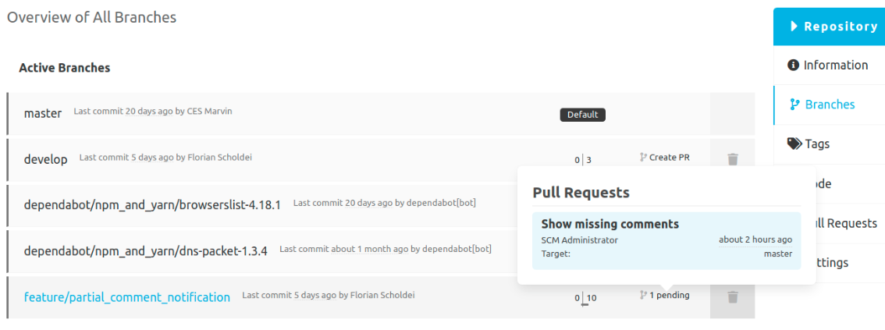

## Pull requests for branches

The branch overview shows the pull requests for each branch.
If there is no pull request for a branch yet, a new pull request can be created via the link.
For the pull request, the author, the creation date and the target branch are displayed in addition to the title.

