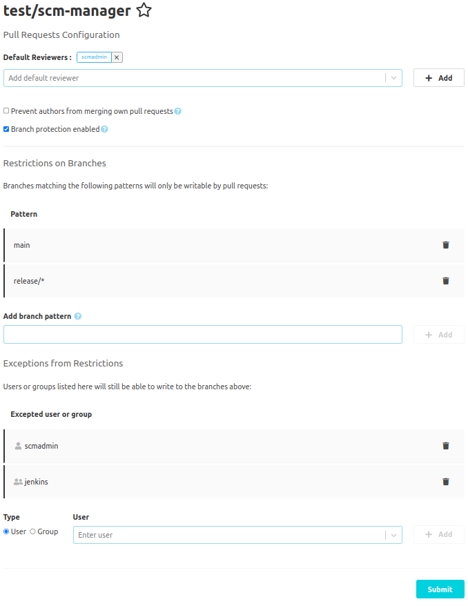

## Configuration

There are some things that can be configured for pull requests.
These configurations can be done globally or repository specific. The global configuration can be found in
"Administration" - "Settings" - "Pull Requests". Likewise, the repository specific configuration is found
in the repository navigation under "Settings" - "Pull Requests". If there are repository specific settings,
these will override global settings.

If you want to prevent repository specific settings, you can disable them in the global settings by checking
"Do not allow repository configuration".

The other settings are identical for global and repository specific configurations. All changes have to be
committed with the "Submit" button.

## Branch Protection

You can specify branches that can only be modified by pull requests and not directly. To do so, check
"Branch protection enabled". If this is checked, there are two tables where protected branches and excepted
users and groups can be specified.

The first table contains patterns for branch names, that will be protected. Here, either fix branch names
(like `main`), or patterns (like `release/*`) can be specified.

If there are special users, that despite these protections should still be able to change the branches (for
example for build automation), these users or groups of users can be specified in the second table. To add
users or groups, first select whether a user or a group should be added, then specify the name (you can also
search for display names in the component), and then add it to the table.

## Merging own Pull Requests

In most scenarios, pull requests will not be merged by the authors themselves. This can even be prevented
by checking "Prevent authors from merging own pull requests".
