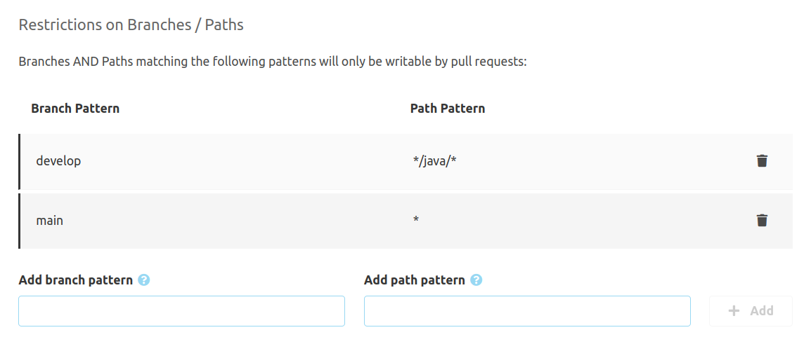

## Configuration

There are some things that can be configured for pull requests.
These configurations can be done globally or repository specific. The global configuration can be found in
"Administration" - "Settings" - "Pull Requests". Likewise, the repository specific configuration is found
in the repository navigation under "Settings" - "Pull Requests". If there are repository specific settings,
these will override global settings.

If you want to prevent repository specific settings, you can disable them in the global settings by checking
"Do not allow repository configuration".

The other settings are identical for global and repository specific configurations. All changes have to be
committed with the "Submit" button.


## Merge Dialog

Here you can set defaults for merges. These are:

- The **Default merge strategy** configures the merge strategy, that will be selected by default in the merge dialog.
- If the option **Delete source branch on merge** is selected, the option to delete the source branch will be activated.
- To use custom text for the default commit messages in the merge dialog, enable the option **Overwrite default
  commit message**. The message set here replaces the default messages created by SCM-Manager.

  It is possible to use template mechanisms in this message. To do so, use double or triple curly braces with variable names
  like `{{{variable}}}`. Variables containing lists of data can be iterated with the patterns `{{#variable}}` and
  `{{/variable}}`. If a variable is a boolean value, conditional parts can be specified the same way.
  
  Variables in double curly braces will be escaped, so that special characters like `&`, `<`, `>`, `"` and line breaks
  are replaced by HTML sequences like `&10;`. To prevent this, use triple curly braces.

  The following variables are available:
  - `namespace` The namespace of the repository
  - `repositoryName` The name of the repository
  - `pullRequest.id` The id of the pull request
  - `pullRequest.title` The title of the pull request
  - `pullRequest.description` The description of the pull request
  - `pullRequest.source` The source branch
  - `pullRequest.target` The target branch
  - `author.displayName` Name of the author
  - `author.mail` Mail address of the Author
  - `currentUser.displayName` The name of the current user
  - `currentUser.mail` Mail of the current user
  - `date` Current date and time (UTC)
  - `localDate` Current date and time (server timezone)
  - `changesets` Commits that will be merged with this pull request. These commits have the following sub attributes:
    - `author.name` Author of the commit
    - `author.mail` Mail address of the author
    - `description` The commit message
    - `id` The revision
  - `contributors` Contributors for this pull request with the following attributes:
    - `type` Type of the contribution
    - `person.name` Contributor's name
    - `person.mail` Contributor's mail address

  Comprehensive documentation for the mustache syntax can be found at the [mustache help page](https://mustache.github.io/).

  Here is an example, rendering some pull request metadata, the commit messages of the single commits and the contributors:

```
Pull Request #{{{pullRequest.id}}} by {{{author.displayName}}}

Merged by {{{currentUser.displayName}}}

Merges the following commits:
{{#changesets}}
  - {{{description}}}
{{/changesets}}

Contributors:
{{#contributors}}
  {{{type}}}: {{{person.name}}} ({{{person.mail}}})
{{/contributors}}
```

## Creation

For the creation of new pull requests, there are some settings documented here.

### Available Labels

Pull Requests can have labels. These can be used for further classification of pull requests,
like `feature`, `bug`, or `library`.

### Default Tasks

Whenever there are tasks that have to be done for most pull requests, they can be configured
as default tasks. On pull request creation, these tasks can be removed when not needed.
Default tasks might be "Translations available" or "Changelog created".

These tasks can be formatted with Markdown (just like the tasks that can be created by reviewers).

### Default Reviewers

If most pull requests have to be reviewed by a small set of people, they can be configured
as default reviewers. On pull request creation, the user can tailor this list by removing
or adding reviewers.

## Branch Protection

You can specify branches that can only be modified by pull requests and not directly. To do so, check
"Branch protection enabled". If this is checked, there are two tables where protected branches and excepted
users and groups can be specified.

The first table contains patterns for branch names and paths, that will be protected. Here, either fix branch names
like `main`, or patterns (like `release/*`) can be specified. 
For paths, you can also use simple paths like `src/main/java` or patterns with wildcards `*/java/*`.
Both values are being combined by `AND`, so to protect a whole branch your path should be `*`.



If there are special users, that despite these protections should still be able to change the branches (for
example for build automation), these users or groups of users can be specified in the second table. To add
users or groups, first select whether a user or a group should be added, then specify the name (you can also
search for display names in the component), and then add it to the table.

## Merging own Pull Requests

In most scenarios, pull requests will not be merged by the authors themselves. This can even be prevented
by checking "Prevent authors from merging own pull requests".

## Default Reviewers

For convenience, a set of default reviewers can be configured for each repository. The reviewer field in the
pull request creation form is automatically pre-populated from that list.
