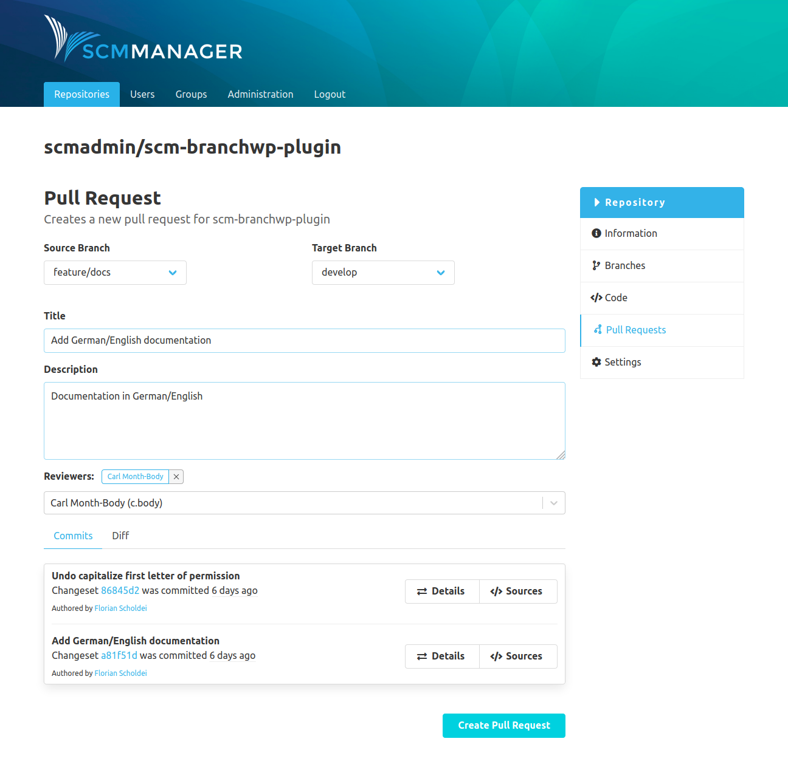
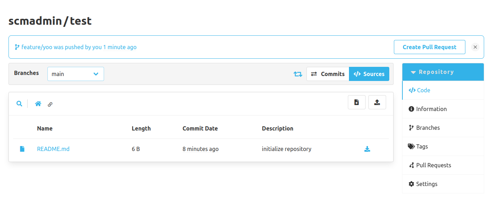

A new pull request for the repository can be created with the button above the pull request overview. It is mandatory to provide the source and the target branch as well as a title. You can also use the checkbox to preselect whether the source branch should be deleted in the event of a successful merge. This preselection can be changed in the merge modal. Optionally it is possible to provide a description (Markdown is supported) and to request specific reviewers.
If reviewers were requested, they receive an e-mail once the pull request is created. Underneath the reviewers a list of default tasks is displayed if they were added in the configuration. The default tasks can be removed for the pull request when they are not needed.

The bottom of the page shows the differences between the two selected branches based on commits and on file level (diff viewer). Each pull request gets a serial number that can be used to clearly identify it in the context.

In addition, the pull request can be created as a draft pull request by ticking the checkbox. A draft pull request is a fully-fledged pull request, but the status “Draft” indicates that this pull request is not yet ready for a review or that the author would like to work on it further.

In addition, the review plugin displays suggestions whether you would like to create a pull request for an updated branch.
These suggestions are displayed in banners below the namespace and the name of a repository.
Each suggestion contains information about which branch has been updated and when this was done.
The suggestions also contain two buttons.
The first allows the user to navigate directly to the view for creating a pull request.
The respective branch is also preselected as the source branch.
The second button allows the user to delete this suggestion directly.

A user is only shown suggestions for branches that have been updated by the user and that do not yet have a pull request.
A suggestion remains for two hours unless it has been deleted by the user or a pull request has been created with the respective branch.

