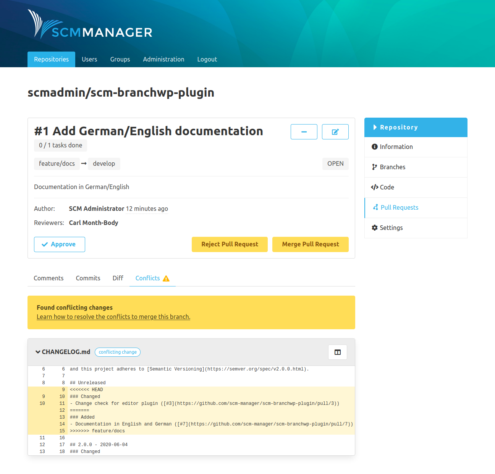

The details page is divided into two parts. The upper part shows all information and options for the pull request. The lower part shows the changes of the pull request in different tabs and it offers the possibility to leave comments.

### Comments
The "Comments" tab contains all comments and tasks that were created for the pull request.

### Commits
The "Commits" tab shows all commits from the source branch starting from where both branches differ.

### Diff
The "Diff" tab shows the changes between the source branch and the root of source and target branches on a file level.

For each file, you will find multiple buttons for various options, like

- zoom the diff
- show or hide whitespace characters
- mark the file as reviewed (this is for your personal workflow only and has no further effect; if a file marked as
  reviewed is changed, the mark will be removed)
- create a comment on file level
- jump to the source or the target file
- a button indicating a merge conflict for this file, if there is one

On the left side just above the diff view you are able to see new, modified and deleted files summarized

On the right side, just opposite of the summarized files there is a coghweel button with the following options:
- The first checkbox show and hide the whitespace changes.
- The second checkbox can collapse all changesets.

The changes are indicated based on the established format:

* **White:** no changes
* **Green:** Line added
* **Red:** Line deleted
* **Red + green:** Line changed

### Conflicts
In the case that there are merge conflicts in a pull request, there is the additional tab "Conflicts".  This tab shows the merge conflicts between the source and the target branch.

Above the conflict itself is a hint on how the conflict could be resolved.

The conflict is shown in the Git-conflict format within a diff in yellow. The head of the conflict is highlighted with a tag that indicates where the conflict originated.

These tags are available:

* **Conflict:** The file was modified in both branches.
* **Deleted in target:** The file was changed in the source branch and deleted in the target branch.
* **Deleted in source:** The file was deleted in the source branch and changed in the target branch.
* **Added in source and target:** The file was added with the same name and path, but with different content in both branches.

