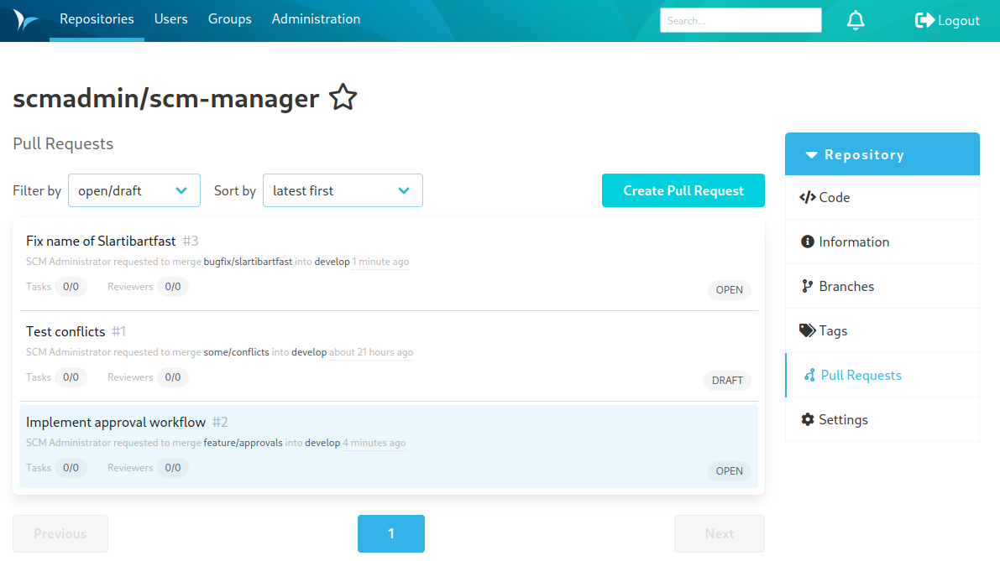

Most of the extensions that come with the Review plugin can be found inside each repository under the tab "Pull Requests". Once the tab is open it shows a list of all pull requests that are open.

The list offers these options:

* open (standard): All pull requests that are open.
* mine: All pull requests that are assigned to the current user.
* to be reviewed: All pull requests that the current user is supposed to review.
* all: All pull requests.
* rejected: All pull requests that were rejected.
* merged: All pull requests that were accepted.

The list has these columns, which can be sorted ascending or descending by clicking on the title of the column.

* Title: The name that gave the author to the pull request.
* Offene Aufgaben:  Number of open tasks for this pull request.
* Source Branch: Name of the branch that contains the changes (source).
* Target Branch: Name of the branch that is supposed to get the changes (target).
* Author: Name of the creator of the pull request.
* Date: Age of the pull request.
* Reviewer:  Icon which shows the requested reviewers for the pull request.
* Status: Status of the pull request (Open/Merged/Rejected)

