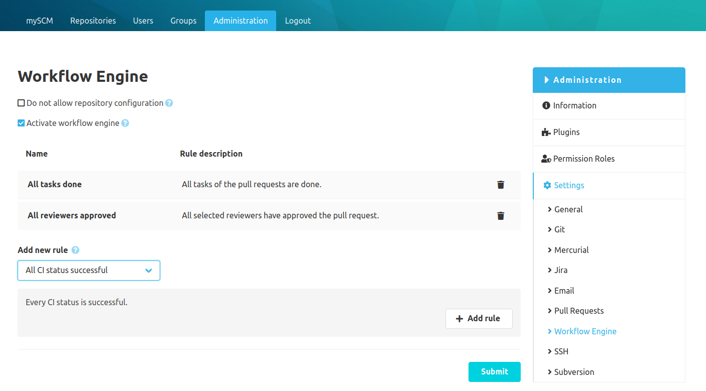

## Configuration
The workflow engine is a rule based configuration to enforce a review process for pull requests.  
If the workflow engine is configured globally or for the repository all pull requests will be checked for the set rules. 
If both workflow engine configurations are enabled only the repository rules will be checked.
It is not possible to mix the rules between these two configurations. 
The repository specific configuration can be disabled in the global config.

### Rules
The workflow engine provides the following rules. Some rules are only available with other SCM-Manager plugins: 

#### General
- `Number of approvals`: There must be at least X approvals by reviewers
- `All reviewers approved`: All selected reviewers have approved the pull request
- `All tasks done`: All tasks of the pull requests are done

### Provided by the SCM-CI-Plugin
- `All CI status successful`: Every CI status is successful
- `Named CI status successful`: A specific CI status is successful
- `All CI status of type are success`: All CI status with a specific type are successful
- `Number of CI status successful`: At least X CI status are successful

## Rules on pull request
The status of the workflow rule validation will be shown as a statusbar on the pull request view.
Click on the statusbar and a detailed dialog will appear showing the status for each single rule.

## Emergency Merge
Enabling the workflow engine will enforce a specific workflow. This workflow may block urgent pull requests if rules cannot be met or are not met yet. 
Last-minute changes like this can be carried out anyway through the "emergency merge". 
The emergency merge can only be carried out by users with special authorization.
It is a "normal" merge with the difference that the rule violation is documented on the pull request.

If an emergency merge was performed:
- the merge label on the pull request will contain an exclamation triangle.
- the violated rules will be shown beneath the pull request description.
- a system comment with an emergency merge label and the reason of the violation will be created on the pull request.
 

