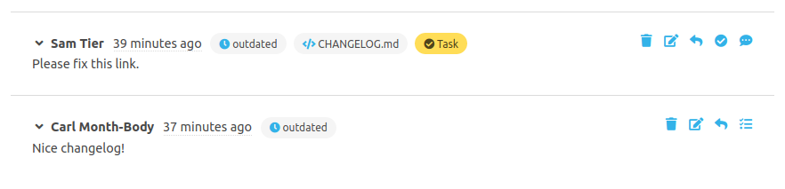
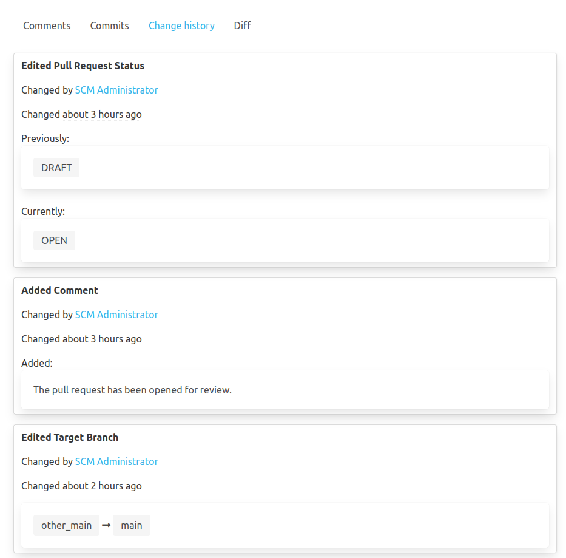

To work efficiently with pull requests there are several ways to exchange information between the author and the reviewer(s).

### Add reviewer
When creating or editing his pull request, the author can add reviewer(s). All reviewers are informed about the upcoming review by e-mail and they are listed in the details of the pull request.

### Subscribe to a pull request
Reviewers can subscribe ("+") or unsubscribe ("-") from a pull request in the upper right corner of the details page of the pull request. Subscribers are informed about changes and comments on the pull request by e-mail.

### Approve pull request
After a successful review, the reviewer can approve the pull request for a merge. At this point, the approval is merely an information for the author that the review is done. Once a reviewer approved a review, there is a green checkmark behind his name in the list of reviewers.
As soon as further changes are made to the code, the review status will be reset.

The [Workflow Engine](../workflow_engine/) can be used to define rules that require approvals from reviewers as part of the review process.

### Expand diff
In the pull request all changes are shown as diff per file. This shortened view may be expanded gradually or completely.

### Create comments
There are three different kinds of comments for pull requests.

* **General comment:** Is related to the pull request in general. It can be created by using the comment editor in the "Comments" tab.
* **File comment:** Can be created in the head of a file in the "Diff" tab. There is an "Add comment for file" button with a speech bubble icon.
* **Line comment:** Can be created by clicking on a line in the diff view.

All comments are shown in the "Comments" tab. The file and line comments are also shown in the "Diff" tab.
It is possible to mention SCM-Manager user in comments. Simply type "@" and right afterwards the name, username or the e-mail-address. 
After the third character an autocomplete form will appear suggesting the best matches.

Additionally, it is possible to use images in comments. To do so, copy and paste an image into the comment editor.
This image will be inserted as a markdown image in the comment and saved separately in the SCM-Manager when saving the comment.
Images can be inserted directly via the clipboard (e.g. when using a screenshot tool) or by copying an image file into
the editor. Allowed image formats are PNG, JPEG and GIF.

There are these options to interact with a comment:

|Icon|Meaning|
|---|--------------------------------------------|
||Delete comment|
||Edit comment|
||Convert comment into task|
||Convert task into comment|
||Reply to comment or task|
||Mark task as done|
||Mark task as *not* done|

### Outdated comments
As soon as there are new commits in a pull request, some comments are marked as outdated. General comments are outdated after each new commit. File and line comments are outdated once a commit changes the related file.

These comments are marked with an "outdated" tag. By clicking on the blue "outdated" tag or a blue file name the original context of the comment is shown. This allows to backtrace why a comment was made.

### Create tasks
If a reviewer finds errors or wants to propose changes, he can do that by using tasks. The comments editor can be changed into a task editor by changing the radio button. Tasks are shown in the details page of the pull request and in the list of pull requests, e.g. "2 / 5 tasks done".

Open tasks can be marked as done using the "Mark as done" icon. At this point tasks solely informative and therefore no condition to merge a pull request.

### Concurrent changes
As several users can review or edit a pull request concurrently, it is quite likely you could miss the latest changes. 
So you will be informed on each change of the pull request by a toast message appearing on your right corner window.

### Convert a pull request
A pull request created as a draft pull request can be converted into an open pull request open for review.
An open pull request can be converted to a draft pull request using the edit function. When converting to a draft, the approvals by users are deleted.

### Reject a pull request
If a reviewer thinks that a pull request should not be merged, they can reject it. That should happen in coordination with the author. You can reopen a rejected pull request at any time.

### Merge a pull request 
If a pull request can be merged, the changes can be applied in different ways after clicking the button "Merge Pull Request":

* **Merge Commit:** The branches are merged with a new commit.
* **Fast forward, if possible:** If possible, the target branch is set to the state of the source branch without a merge. If this is not possible, a regular merge commit is created.
* **Squash:** All changes from the source branch are condensed into one commit on the target branch. The commit history of the source branch is not transferred to the target branch.
* **Rebase:** All changes from the source branch are individually reapplied on the target branch. No merge commit is created.

If desired, it is possible to replace the default message with an individual commit message. If the box "Delete branch" is checked, the source branch is deleted from the repository after the successful merge. 

In case of a merge conflict, the pull request cannot be merged automatically. The conflicts have to be resolved manually before the merge.

Approvers of this pull request will be set as "Reviewed-by" in the merge commit.

### Edit a pull request

A pull request can be edited after creation. The author can

- change the target branch,
- change the default setting to delete the source branch,
- change the title,
- change the description,
- change the reviewer and
- change the labels.

If the target branch is changed, all approvals by reviewers are reset.

### Pull Request History

All changes to a pull request are collected and can be viewed as a history of changes.
Here are some of the tracked properties:

- Source branch revision
- Target branch
- Title
- Description
- Reviewer
- Comments 
- Tasks
- Pull request status

