% Review-Plugin Dokumentation
% Cloudogu GmbH

# Review-Plugin
Mit dem Review-Plugin unterstützt der SCM-Manager sogenannte Pull- bzw. Merge-Requests, mit deren Hilfe ein Vier-Augen-Prinzip bei der Softwareentwicklung umgesetzt werden kann. Der Ablauf betrachtet in der Regel die Umsetzung eines Features oder die Behebung eines Fehlers (Bugfix).

## Übersicht
Der Großteil aller vom Review-Plugin mitgelieferten Erweiterungen sind innerhalb eines Git Repositories unter dem Tab "Pull Requests" zu finden. Beim Aufruf des Bereichs erscheint eine Übersicht aller derzeit offenen Pull Requests. 

Diese Übersicht lässt sich nach den folgenden Kategorien filtern:

- offen (Standard): Alle offenen Pull Requests
- meine: Pull Requests des eingeloggten Nutzers
- zu reviewen: Pull Requests, die der eingeloggte Nutzer kontrollieren soll
- alle: Alle Pull Requests
- abgelehnt: Abgelehnte Pull Requests
- gemerged: Akzeptierte Pull Requests

Die Übersichts-Tabelle besteht aus den folgenden Spalten, die sich durch einen Klick auf den Spaltenkopf anhand der Werte auf- bzw. absteigend sortieren lassen:

- Titel: Vom Autor festgelegter Name des Pull Requests
- Offene Aufgaben: Anzahl offener Aufgaben zum Pull Request
- Source Branch: Branch, der die Änderungen enthält (Quelle)
- Target Branch: Branch, auf welchen die Änderungen angewendet werden sollen (Ziel)
- Autor: Ersteller des Pull Requests
- Datum: Alter des Pull Requests
- Reviewer: Icon, welches die zugehörigen Reviewer zum Pull Request anzeigt
- Status: Status des Pull Requests (Open/Merged/Rejected)

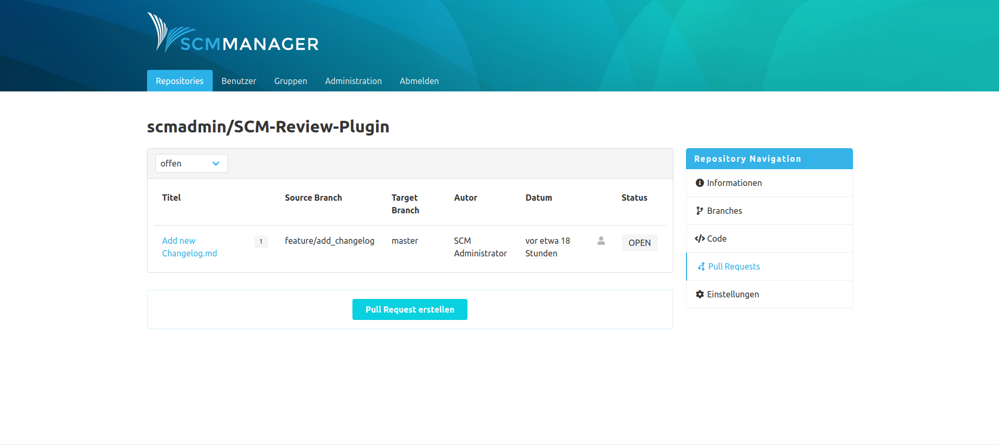

## Pull Request erstellen

Unterhalb der Tabelle kann mit Klick auf die Schaltfläche ein neuer Pull Requests für das aktuelle Repository erstellt werden.
Nach Auswahl des Source und Target Branchs muss ein Titel festgelegt werden. Zudem können eine Beschreibung (Markdown wird unterstützt) und Reviewer zugeordnet werden. Wurden Reviewer eingetragen, erhalten diese bei der Erstellung des Pull Requests eine E-Mail. 

Im unteren Bereich können die Änderungen zwischen den gewählten Branches in Form von Commits und als Unterschiede auf Dateiebene (in Diff-Ansichten) geprüft werden. Jedem Pull Request wird eine einmalige, fortlaufende Nummer zugeordnet, über die er eindeutig im Kontext identifiziert werden kann.

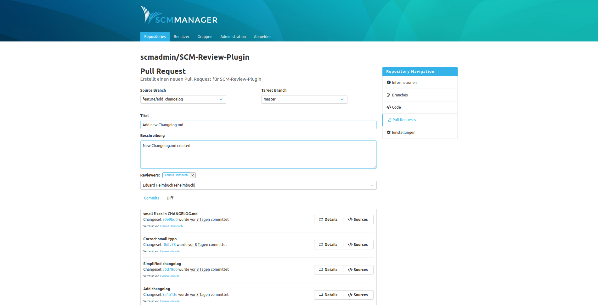

## Detailseite
Die Detailseite unterteilt sich in zwei Bereiche. Im oberen umrahmten Teil wird der generelle Pull Request mitsamt möglichen Interaktionen dargestellt. Darunter lassen sich die eigentlichen Änderungen des Pull Requests in unterschiedlichen Tabs anzeigen und kommentieren.

#### Kommentare
In dem Tab "Kommentare" findet man alle Kommentare und Aufgaben, die zu diesem Pull Request erstellt wurden.

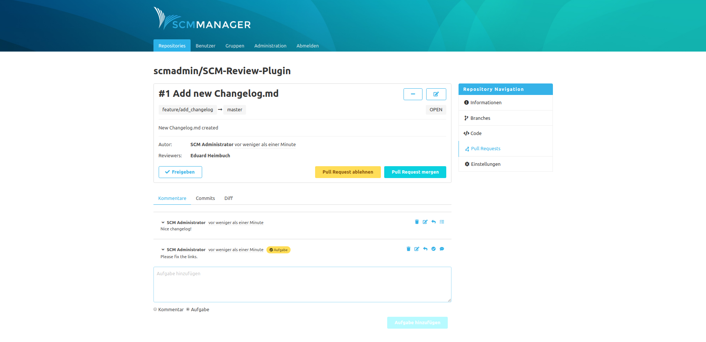

#### Commits
Der "Commits"-Tab zeigt alle Commits des Source Branches an, ab dem Commit wo die Branches sich unterscheiden.

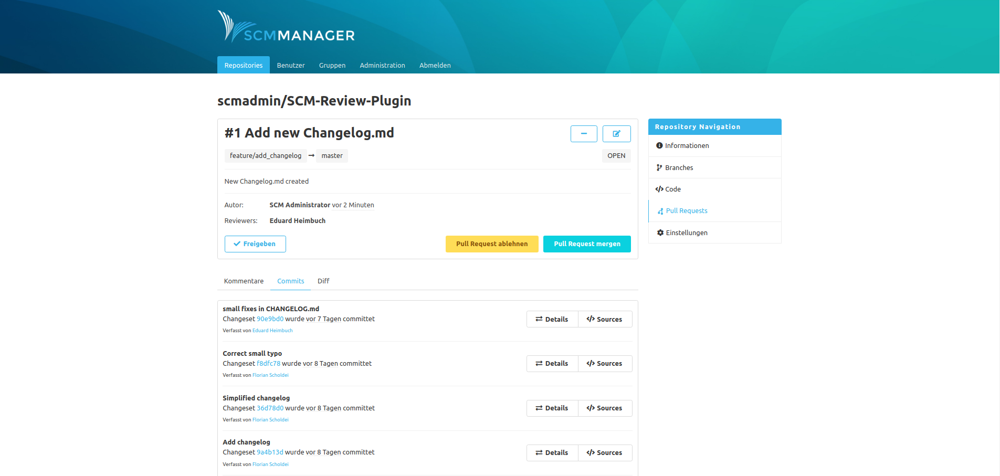

#### Diff
Unter "Diff" findet man die Änderungen der Dateien zwischen dem Target Branch und dem Source Branch. 

Die Änderungen sind nach dem bekannten Format für Diffs farblich gekennzeichnet:

- __Weiß:__ Keine Änderungen
- __Grün:__ Zeile hinzugefügt
- __Rot:__ Zeile entfernt
- __Rot + Grün:__ Zeile geändert

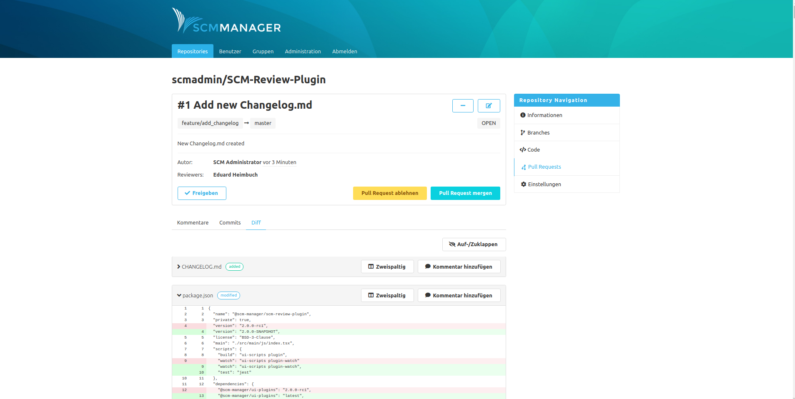

#### Konflikte
Sollten Merge-Konflikte in einem Pull Request existieren, gibt es zusätzlich den Tab "Konflikte". Dort zeigt der SCM-Manager die Merge-Konflikte zwischen dem Source Branch und dem Target Branch an. 

Über dem eigentlichen Konflikt bekommt man eine Anleitung angeboten, wie dieser Merge-Konflikt behoben werden kann.

Der Konflikt wird im Git-Konflikte-Format innerhalb eines Diffs in Gelb angezeigt. In der Kopfzeile des Diffs wird über einen "Tag" hervorgehoben, wie dieser Konflikt entstanden ist.

Folgende Tags sind möglich:

- __Konflikt__: Datei wurde auf beiden Branches in denselben Zeilen geändert
- __im Target gelöscht:__ Datei wurde im Source Branch geändert und auf dem Target Branch gelöscht
- __im Source gelöscht:__ Datei wurde im Source Branch gelöscht und auf dem Target Branch verändert
- __in Source und Target hinzugefügt:__ In beiden Branches wurde eine neue Datei mit selbem Dateinamen und -pfad aber unterschiedlichem Inhalt hinzugefügt

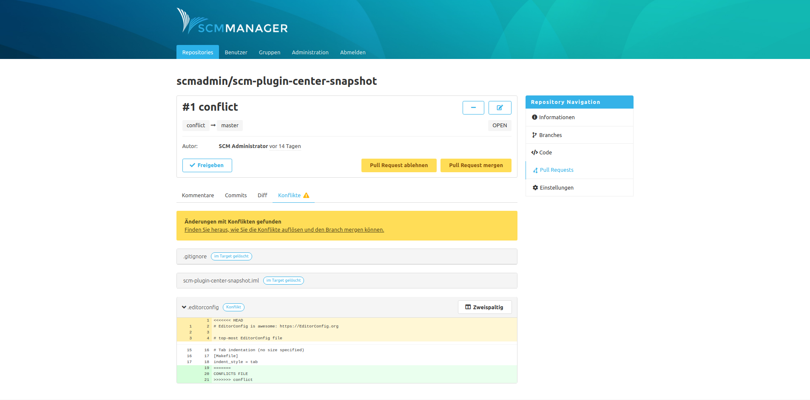

 
## Arbeiten mit Pull Requests
Für ein effizientes Arbeiten mit Pull Requests gibt es unterschiedliche Möglichkeiten Informationen zwischen dem Autor und dessen Reviewern auszutauschen.

#### Reviewer hinzufügen
Der Autor kann beim Erstellen bzw. Editieren seines Pull Requests Wunsch-Reviewer eintragen. Diese Reviewer werden per E-Mail über das anstehende Review informiert und sind in den Pull Request Details aufgelistet. 

#### Pull Request abonnieren
Oben rechts auf der Pull Request Detailseite kann ein Reviewer mit einem Klick auf den "+" (Plus) bzw. "-" (Minus) Button diesen Pull Request abonnieren / deabonnieren.  Der Abonnent wird über Änderungen an diesem Pull Request und neue Kommentare per E-Mail benachrichtigt.

#### Pull Request freigeben
Nach einem Review kann der Reviewer den Pull Request für den Merge freigeben. Die Freigabe gilt vorerst nur als Informationen für den Autor über das durchgeführte Review. Eine tatsächliche Freigabe im Sinne eines Entsperrens findet noch nicht statt. Sobald ein Reviewer auf "Freigeben" klickt, wird hinter seinem Namen in der Reviewer-Liste ein grüner Haken hinterlegt.

#### Kommentare erstellen
Für einen Pull Request können drei Arten von Kommentaren erstellt werden. 

- __Allgemeiner Kommentar:__ Bezieht sich auf den Pull Request als Ganzes. Kann im Kommentar-Tab über den Kommentar-Editor erstellt werden.
- __Datei-Kommentar:__ Kann im Diff-Tab in der Kopfzeile einer Datei über "Kommentar hinzufügen" erstellt werden.
- __Zeilen-Kommentar:__ Kann über einen Klick auf eine Zeile im Diff erstellt werden.

Alle Kommentare findet man in dem Kommentar-Tab. Die Datei- und Zeilen-Kommentare findet man auch direkt an der Datei in dem Diff-Tab.

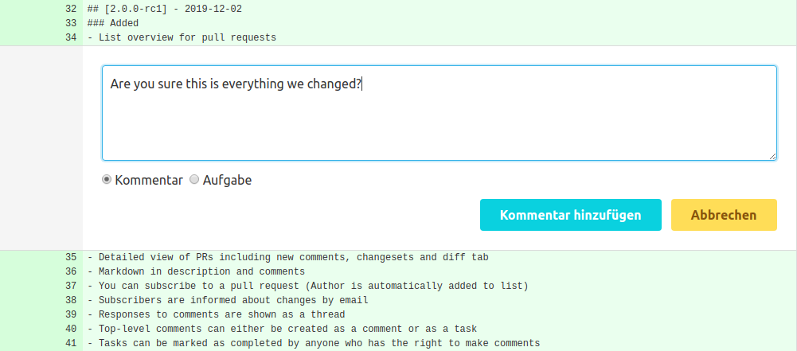

Erstellte Kommentare bieten folgende Interaktions-Möglichkeiten:

|Icon|Bedeutung|
|-----------|--------------------------------------------|
|{ "height=5em" }|Kommentar löschen|
|{ height=5mm }|Kommentar bearbeiten|
|{ height=5mm }|Kommentar in Aufgabe umwandeln|
|{ height=5mm }|Aufgabe in Kommentar umwandeln|
|{ height=5mm }|Auf Kommentar bzw. Aufgabe antworten|
|{ height=5mm }|Aufgabe als erledigt markieren|
|{ height=5mm }|Aufgabe als _nicht_ erledigt markieren|

#### Veraltete Kommentare
Sobald ein Pull Request neue Commits erhält, werden die Kommentare teilweise als veraltet markiert. Allgemeine Kommentare gelten nach jedem neuen Commit als veraltet und Datei- bzw. Zeilen-Kommentare nach einem Commit, der die entsprechende Datei ändert.

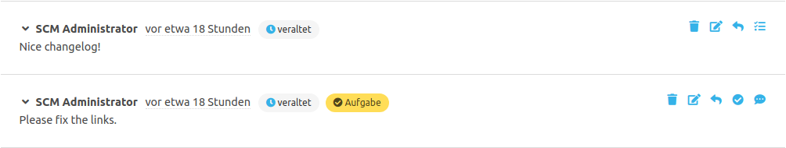

Diese Kommentare werden mit einem "Veraltet"-Tag markiert. Mit einem Klick auf einen blauen Veraltet-Tag bzw. einen blauen Dateinamen-Tag, öffnet sich der ursprüngliche Kontext, zu dem dieser Kommentar erstellt wurde. Damit lässt sich auch nach neuen Änderungen nachvollziehen, warum dieser Kommentar erstellt worden war.

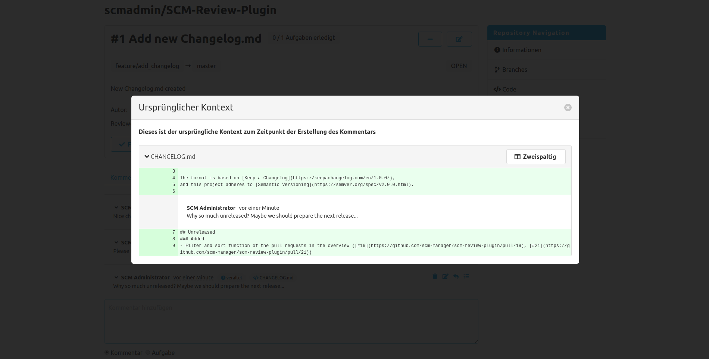

#### Aufgaben erstellen
Sollte ein Reviewer Fehler finden oder Änderungen am Pull Request vorschlagen wollen, kann er dies über Aufgaben realisieren. Der Kommentar-Editor kann über einen Radio-Button zu einem Aufgaben-Editor umgeschaltet werden. Aufgaben werden in den Pull Request Details und in der Übersichtstabelle über einen Tag angezeigt, beispielsweise "2 / 5 Aufgaben erledigt". 

Offene Aufgaben können über ein Icon auf "abgeschlossen" gesetzt werden. Aufgaben sind derzeit noch informativ und keine zwingende Voraussetzung zum Mergen des Pull Requests.

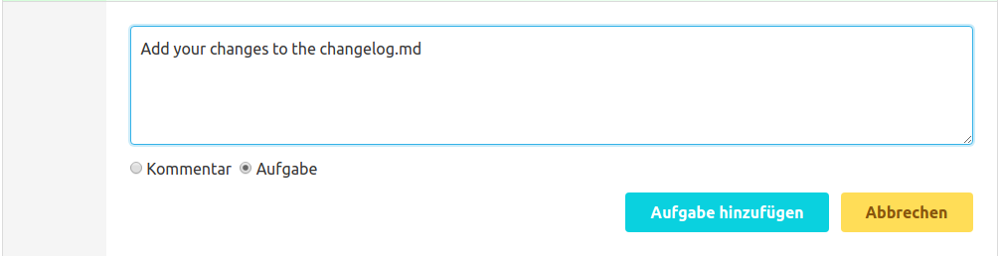

#### Pull Request ablehnen
Sollte ein Pull Request aus Sicht der Reviewer nicht gemerged werden dürfen, kann dieser Pull Request abgelehnt werden. Dies sollte in Abstimmung mit dem Pull Request Autor passieren. Ein abgelehnter Pull Request kann nicht erneut geöffnet werden. Es muss stattdessen ein neuer Pull Request erstellt werden.

#### Pull Request mergen

Sollte ein Pull Request mergebar sein, können die Änderungen über den Button "Pull Request mergen" auf verschiedene Arten angewendet werden:

- __Merge Commit:__ Die Branches werden mit einem neuen Commit gemerged.
- __Fast-Forward, wenn möglich:__ Falls möglich wird der Target Branch ohne Merge auf den Stand des Source Branches gesetzt. Falls dies nicht möglich ist, wird ein normaler Merge Commit erzeugt.
- __Squash:__ Alle Änderungen des Source Branches werden als ein neuer Commit auf dem Target Branch zusammengefasst. Die Commit-Historie des Source Branches wird dabei nicht in den Target Branch übertragen.

Für den Merge kann statt der vorgegebenen Muster-Nachricht eine eigene Commit-Nachricht eingetragen werden. Über die Checkbox "Branch löschen" wird der Source-Branch nach dem erfolgreichen Merge aus dem Repository entfernt.

Im Falle eines Merge-Konflikts kann der Pull Request nicht automatisch gemerged werden. Die Konflikte müssen vor dem Merge manuell aufgelöst werden.

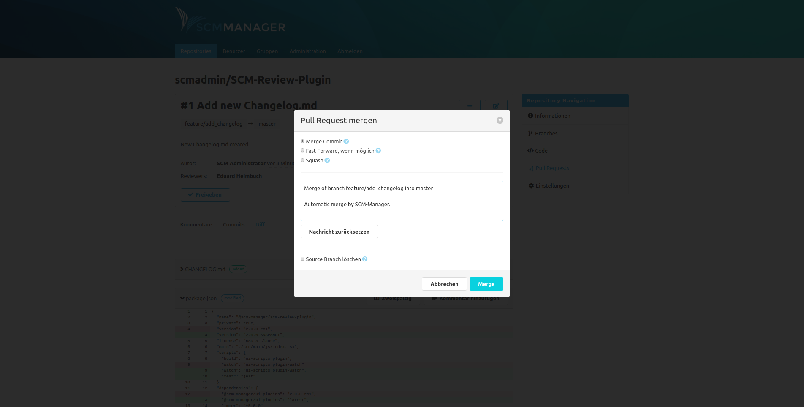

## Berechtigungen
Das Review Plugin bringt folgende Berechtigungen mit:

- Globale Berechtigungen:
    - Alle Pull Requests lesen: Darf alle Pull Requests aus allen Repositories lesen
    - Alle Pull Requests bearbeiten: Darf Pull Requests für alle Repositories erstellen, kommentieren und ablehnen
- Repository-spezifische Berechtigungen
    - Pull Requests erstellen: Darf neue Pull Requests erstellen
    - Pull Requests lesen: Darf Pull Requests lesen
    - Pull Requests kommentieren: Darf Pull Requests kommentieren
    - Pull Requests bearbeiten: Darf den Titel, Beschreibung und Reviewer von Pull Requests sowie Kommentare von anderen Benutzern bearbeiten
    - Pull Requests mergen/ablehnen: Darf Pull Requests akzeptieren (mergen) oder ablehnen (für den Merge wird zusätzlich die Push-Berechtigung benötigt)

Benutzer mit der Rolle READ können automatisch Pull Requests dieses Repositories lesen. Mit der Rolle WRITE kommen zusätzlich die Berechtigungen zum Erstellen, Kommentieren und Akzeptieren bzw. Ablehnen hinzu.

## Branches schützen
### Lokal
In den Repository-Einstellungen gibt es den Tab "Pull Requests". Dort kann ein Repository-bezogener Schutz für Branches aktiviert werden. Für den Schutzmechanismus können Branches mit Namen oder auch als Muster (z. B. "feature/*") eingetragen werden, für die der Schreibschutz gelten soll. Ist ein Branch geschützt, können Änderungen ausschließlich über Pull Requests auf diesen Branch committet werden. Mithilfe dieser Einschränkung kann ein Review-Workflow über Pull Requests erzwungen werden.

### Global
Es gibt zusätzlich die Möglichkeit einen Repository-übergreifenden Schreibschutz über die Administrations-Oberfläche zu definieren. Damit kann man beispielsweise festlegen, dass per Default in keinem Repository direkt auf den "master"-Branch gepusht werden darf, wenn keine spezifische Konfiguration für dieses Repository vorhanden ist.

Will man verhindern das Repository-Owner ihren eigenen Branch-Schutz definieren, kann über eine Checkbox der lokale Branch-Schutz für die SCM-Manager-Instanz deaktiviert werden.
